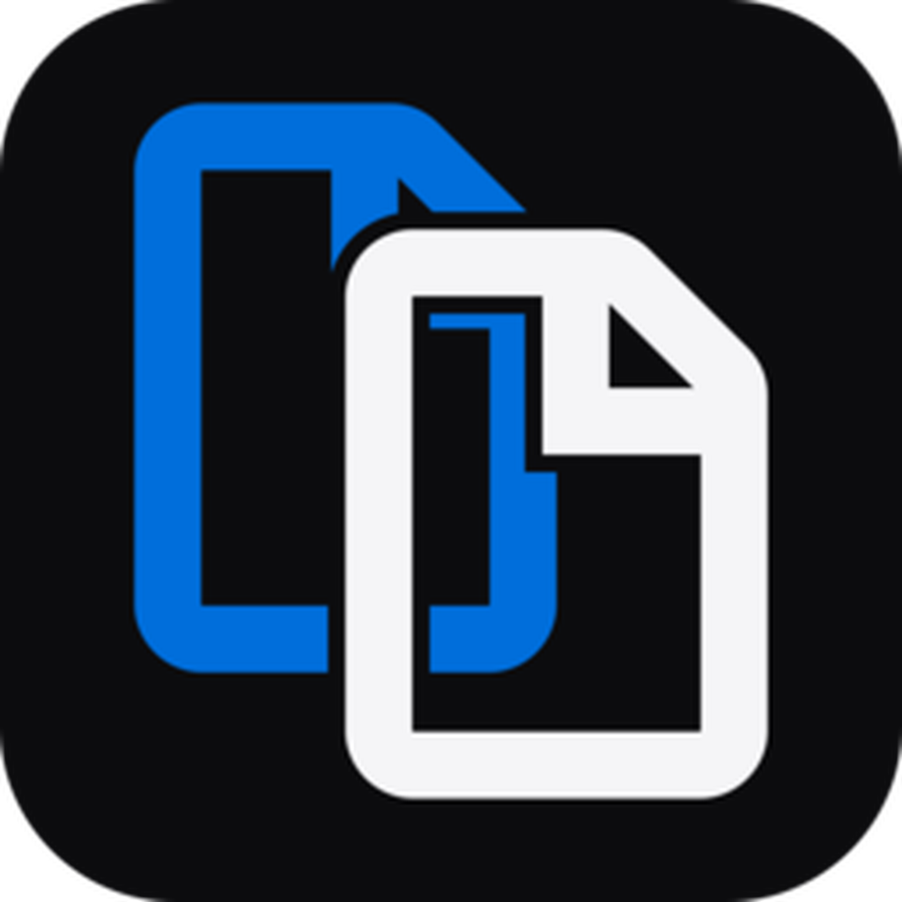

<div align="center">
  

# _davDUPLICATE

**Trova duplicati reali e recupera spazio senza cancellazioni automatiche.**  
**Find true duplicates and reclaim space without automatic deletion.**

`v1.0.1` · Windows · macOS · Linux · Local-first · Open source

[](#-italiano)
[](#-english)

</div>

---

# 🇮🇹 Italiano

_davDUPLICATE è un'app desktop multipiattaforma di **_davstudios** progettata per trovare file realmente identici senza affidarsi soltanto al nome o all'estensione.

La scansione rimane **interamente locale** e segue una pipeline progressiva per evitare di calcolare subito l'hash completo di ogni file.

<p>
  <a href="https://www.davstudios.it"></a>
  <a href="https://buymeacoffee.com/davstudios"></a>
</p>

## Come trova i duplicati

```text
1. Raggruppamento per dimensione
2. Quick hash sui candidati
3. Hash BLAKE3 completo
4. Verifica byte per byte
```

Solo i file che superano tutte le fasi vengono mostrati come duplicati esatti.

### Funzioni principali

- selezione di file e cartelle;
- drag & drop;
- scansione ricorsiva senza seguire symlink;
- pipeline size → quick hash → BLAKE3 → byte verification;
- riconoscimento degli hard link;
- spazio recuperabile per gruppo e totale;
- filtri per nome, percorso, dimensione ed estensione;
- auto-selezione Keep oldest, Keep newest, shortest path e cartella preferita;
- selezione manuale dei file;
- annullamento della scansione;
- spostamento dei file selezionati nel Cestino/Trash;
- registro locale delle operazioni di pulizia;
- italiano e inglese;
- tema Sistema, Chiaro e Scuro.

> Gli hard link possono avere percorsi diversi ma condividere gli stessi dati fisici. _davDUPLICATE li segnala e non li considera spazio duplicato recuperabile.

<details>
<summary><strong>Sicurezza</strong></summary>

_davDUPLICATE non elimina automaticamente alcun file. La selezione viene sempre mostrata prima dell'operazione e la pulizia usa il Cestino/Trash del sistema operativo.

I symlink non vengono seguiti durante la scansione, riducendo il rischio di loop o attraversamenti inattesi del filesystem.

</details>

<details>
<summary><strong>Privacy</strong></summary>

- nessun account;
- nessun upload;
- nessuna elaborazione cloud;
- nessuna telemetria integrata;
- hash e confronti eseguiti sul dispositivo.

</details>


## Piattaforme

| Sistema | Architettura | Pacchetto |
| --- | --- | --- |
| Windows 10/11 | x64 | NSIS `.exe` |
| macOS | Intel + Apple Silicon | Universal `.dmg` |
| Linux | x64 | `.AppImage` / `.deb` |

## Sviluppo locale

```bash
npm install
npm run desktop
```

Test:

```bash
npm test
```

Build:

```bash
npm run bundle
```

## Tecnologia

_davDUPLICATE usa **Tauri 2**, **Rust**, **JavaScript + Vite**, **BLAKE3** e una verifica finale byte per byte. Il design system e il motion language sono condivisi con `_davRENAME` e `_davIMAGE`.

## Licenza

Distribuito con licenza **MIT**. Consulta [`LICENSE`](LICENSE).

<div align="right"><a href="#davduplicate">↑ Torna all'inizio</a></div>

---

# 🇬🇧 English

_davDUPLICATE is a cross-platform desktop app by **_davstudios** designed to find truly identical files without relying only on filenames or extensions.

Scanning stays **entirely local** and uses a staged pipeline so full hashing is only performed on real candidates.

<p>
  <a href="https://www.davstudios.it/en"></a>
  <a href="https://buymeacoffee.com/davstudios"></a>
</p>

## How duplicates are detected

```text
1. Group by file size
2. Quick hash candidates
3. Full BLAKE3 hash
4. Byte-for-byte verification
```

Only files that pass every stage are presented as exact duplicates.

### Main features

- native file and folder selection;
- drag & drop;
- recursive scanning without following symlinks;
- size → quick hash → BLAKE3 → byte verification pipeline;
- hard-link awareness;
- reclaimable space per group and overall;
- filters by name, path, size, and extension;
- Keep oldest, Keep newest, shortest path, and preferred-folder auto-selection;
- manual file selection;
- cancellable scanning;
- move selected files to the operating system Trash/Recycle Bin;
- local cleanup activity log;
- Italian and English interface;
- System, Light, and Dark themes.

> Hard links may have different paths while sharing the same physical data. _davDUPLICATE marks them and excludes them from reclaimable duplicated storage.

<details>
<summary><strong>Safety</strong></summary>

_davDUPLICATE never deletes files automatically. Selection is always visible before an action and cleanup uses the operating system Trash/Recycle Bin.

Symlinks are not followed during scanning, reducing the risk of loops or unexpected filesystem traversal.

</details>

<details>
<summary><strong>Privacy</strong></summary>

- no account;
- no uploads;
- no cloud processing;
- no built-in telemetry;
- hashes and comparisons run on your device.

</details>


## Platforms

| System | Architecture | Package |
| --- | --- | --- |
| Windows 10/11 | x64 | NSIS `.exe` |
| macOS | Intel + Apple Silicon | Universal `.dmg` |
| Linux | x64 | `.AppImage` / `.deb` |

## Local development

```bash
npm install
npm run desktop
```

Tests:

```bash
npm test
```

Build:

```bash
npm run bundle
```

## Technology

_davDUPLICATE uses **Tauri 2**, **Rust**, **JavaScript + Vite**, **BLAKE3**, and final byte-for-byte verification. Its design system and motion language are shared with `_davRENAME` and `_davIMAGE`.

## License

Released under the **MIT License**. See [`LICENSE`](LICENSE).

<div align="right"><a href="#davduplicate">↑ Back to top</a></div>
